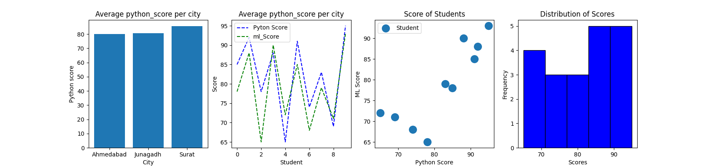
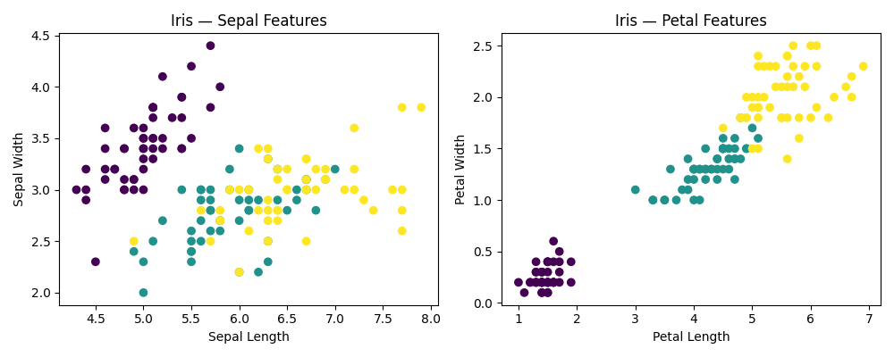
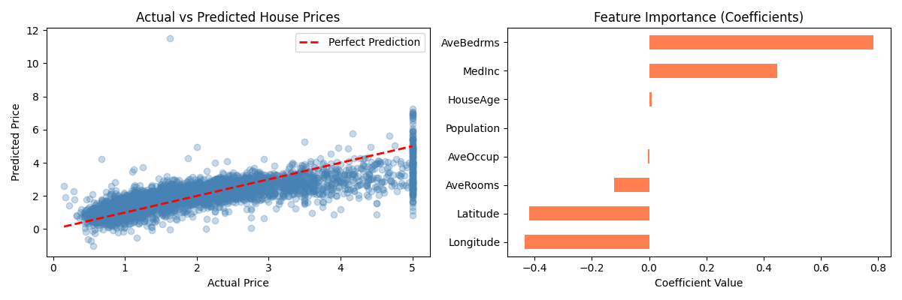
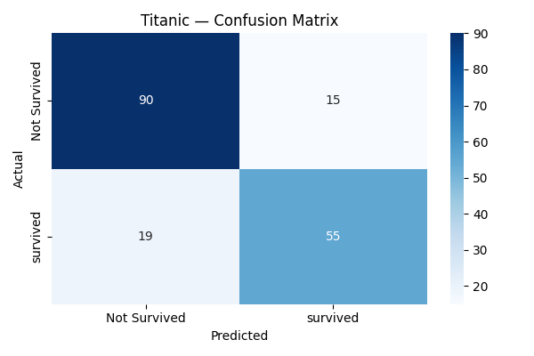
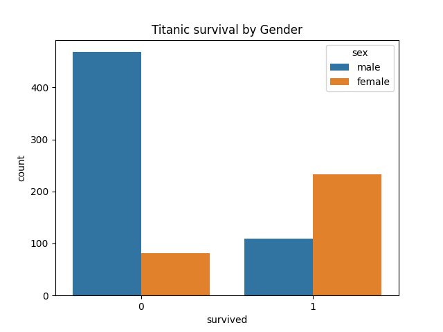
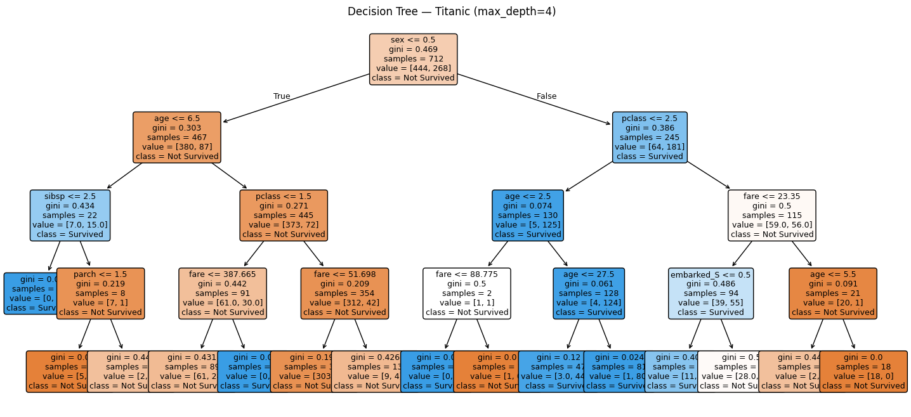
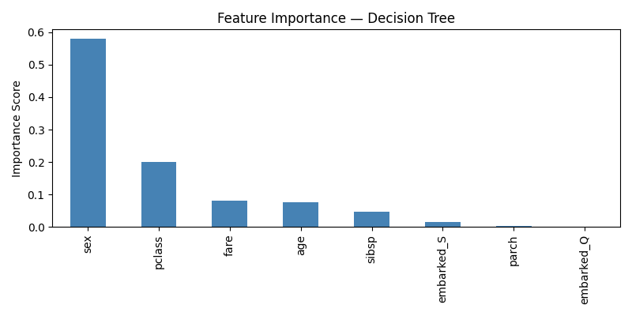
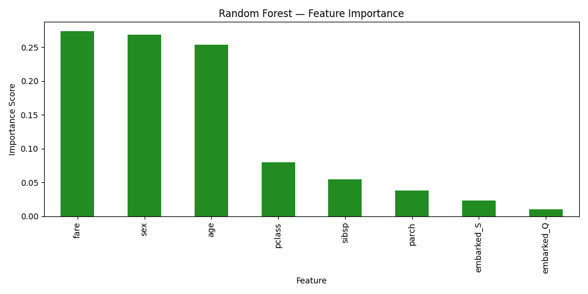
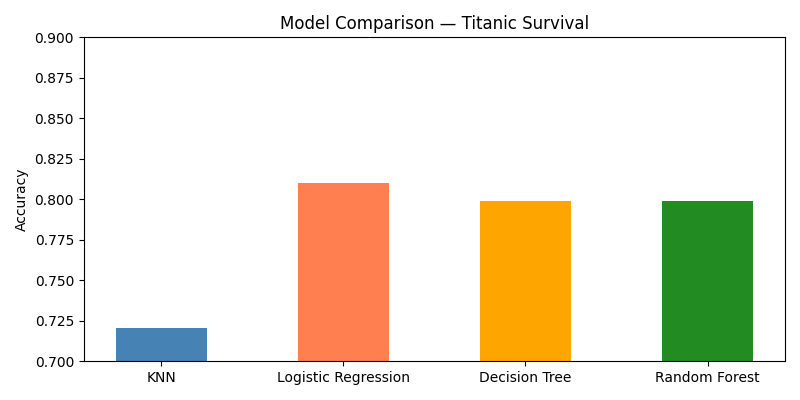

<div align="center">

# 🐍 Python → Machine Learning — Hands-On Journey

[](https://python.org)
[](https://scikit-learn.org)
[](https://pandas.pydata.org)
[](https://matplotlib.org)


> **Every chart in this repo was generated by code I wrote myself.**
> *No tutorials copied. No AI-generated code. Real datasets. Real results.*

</div>

---

## 👩‍💻 About Me

I'm **Nidhi Zalavadiya** — a Python developer from Junagadh, Gujarat with 2+ years building production automation systems. I'm now applying that engineering mindset to Machine Learning — writing clean, readable code and measuring every result.

**I don't just run algorithms. I ask: why did this model perform better? What does this feature importance tell me about the data?**

---

## 🔬 What I've Built & Learned

### 📊 Student Score Analysis — Pandas + Matplotlib/Seaborn
> *Real dataset. 4 different chart types. Data cleaning + visualization pipeline.*



**What I did:**
- Loaded and cleaned a student dataset with city, Python score, and ML score columns
- Built 4 chart types in one figure: bar chart, line plot, scatter plot, histogram
- Used `groupby()` to find average scores per city — Surat students scored highest
- Identified correlation between Python score and ML score using scatter

**Code skills demonstrated:** `pandas`, `matplotlib.pyplot`, `seaborn`, `groupby`, `subplots`

---

### 🌸 Iris Dataset — EDA & Feature Visualization
> *Classic ML dataset. Used scatter plots to visually confirm class separability before modeling.*



**What I did:**
- Loaded Iris dataset from sklearn, converted to DataFrame
- Built side-by-side scatter plots: Sepal features vs Petal features
- **Key insight:** Petal features separate the 3 classes cleanly — Sepal features overlap. This means petal measurements will be more important features in any classifier.

**Code skills demonstrated:** `sklearn.datasets`, `seaborn.scatterplot`, feature analysis thinking

---

### 📈 Linear Regression — California House Price Predictor
> *Regression on real data. Visualized actual vs predicted. Analyzed which features drive price.*



**What I did:**
- Trained Linear Regression on California Housing dataset (20,000+ samples)
- Plotted Actual vs Predicted — model follows the trend but struggles at high prices (common in linear models)
- Analyzed feature coefficients: `AveBedrms` and `MedInc` are strongest positive predictors; `Latitude` and `Longitude` are negative (location effect)

**Key learning:** A straight line can't capture non-linear price jumps — this is exactly why we need tree-based models.

**Code skills demonstrated:** `LinearRegression`, `train_test_split`, coefficient analysis, `matplotlib`

---

### 🎯 Logistic Regression — Titanic Survival Classifier
> *Binary classification. Confusion matrix analysis. Understanding precision vs recall tradeoff.*



**What I did:**
- Built a Logistic Regression classifier on Titanic dataset
- Achieved **~82% accuracy** — correctly predicted 90 non-survivors and 55 survivors
- Analyzed confusion matrix: 19 false negatives (predicted not survived, actually survived) — in a real scenario, this type of error matters more than false positives
- Visualized survival by gender: females survived at much higher rates (women & children first policy confirmed in data)



**Key learning:** Accuracy alone is misleading. A model predicting "nobody survives" gets 61% accuracy on Titanic — but it's useless. Confusion matrix tells the real story.

**Code skills demonstrated:** `LogisticRegression`, `confusion_matrix`, `classification_report`, `seaborn.heatmap`

---

### 🌳 Decision Tree — Titanic (max_depth=4)
> *Visualized the full decision tree. Understood how the model actually splits data.*



**What I did:**
- Trained Decision Tree with `max_depth=4` to prevent overfitting
- Visualized the full tree — first split is on `sex <= 0.5` (encoded: male=1, female=0)
- **The tree confirms what history tells us:** females (sex=False) go right → most survived. Males (sex=True) go left → most didn't survive.
- Analyzed feature importance — `sex` dominates at 0.58, `pclass` second at 0.20



**Key learning:** Decision Trees are explainable — you can trace exactly *why* a prediction was made. This matters in real business applications (banking, healthcare, legal).

**Code skills demonstrated:** `DecisionTreeClassifier`, `plot_tree`, `feature_importances_`, Gini impurity understanding

---

### 🌲 Random Forest — Feature Importance & Model Comparison
> *Ensemble learning. Compared 4 models on same dataset. Understood when Random Forest beats Decision Tree.*



**What I did:**
- Trained Random Forest on Titanic — **feature importance shifted significantly vs Decision Tree**
- In Decision Tree: `sex` = 0.58 dominant. In Random Forest: `fare`, `age`, `sex` are all ~0.24-0.26 — more balanced, more realistic
- This shows Random Forest is less biased toward one feature — it samples features randomly across trees



**Model Comparison on Titanic Survival:**

| Model | Accuracy |
|-------|----------|
| KNN | ~72% |
| Decision Tree | ~80% |
| Random Forest | ~80% |
| **Logistic Regression** | **~81%** ✅ Best |

**Key learning:** More complex ≠ always better. Logistic Regression outperformed Random Forest here because Titanic survival has strong linear relationships (sex, class). Random Forest wins on complex, non-linear data.

**Code skills demonstrated:** `RandomForestClassifier`, `feature_importances_`, model comparison, choosing the right model

---

## 🛠️ Tech Stack Used

<div align="center">


</div>

---

## 📁 Repo Structure

```
Python-Fundamentals/
│
├── 🐍 Python Core (Day 01–14)
│   ├── day01.py – day06.py          # Data types, OOP, functions
│   ├── day03_noon_2sum.py            # LeetCode: Two Sum
│   ├── day05_leetcode_*.py           # LeetCode: Palindrome, Contains Duplicate
│   ├── day04_student_management_system.py
│   └── review_week01.py             # CLI Grade Manager (Week exam)
│
├── 📊 Data & ML (Day 09–13)
│   ├── day09_iris.py                 # EDA — Iris scatter plots
│   ├── day10_linear_regression.py    # House price predictor
│   ├── day11_logistic_regression.py  # Titanic — Logistic Regression
│   ├── day12_decision_tree.py        # Titanic — Decision Tree + visualization
│   ├── day13_random_forest.py        # Titanic — RF + model comparison
│   └── Student_Data_Analysis.py     # Custom dataset — 4-chart EDA
│
├── 📂 images/                        # All output charts (auto-generated by code)
├── 📂 models/                        # OOP model classes
└── 📂 utils/                         # Helper utilities
```

---

## 🔮 What's Next

- [ ] Model evaluation deep dive — Cross-validation, GridSearchCV, ROC-AUC
- [ ] KMeans Clustering — Customer segmentation project
- [ ] Neural Networks — MNIST digit classifier with Keras
- [ ] NLP — Sentiment analysis on product reviews
- [ ] HuggingFace — Load and run a pre-trained model
- [ ] LangChain — RAG app deployed on Streamlit
- [ ] **Capstone:** End-to-end ML project with domain data (ERP/Financial)

---

## 🤝 Connect

<div align="center">

[](https://linkedin.com/in/nidhizavalaiya)
[](https://github.com/Nidhi-Zalavadiya)
[](mailto:nidhizalavadiya2707@gmail.com)

</div>

---

<div align="center">


*"I don't just run models. I understand what they're telling me about the data."*

</div>
